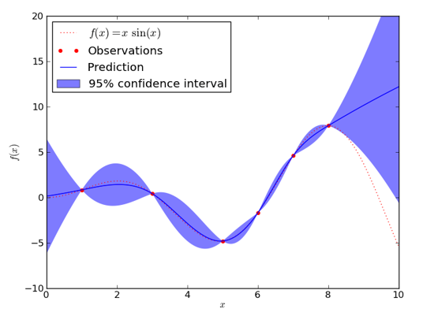
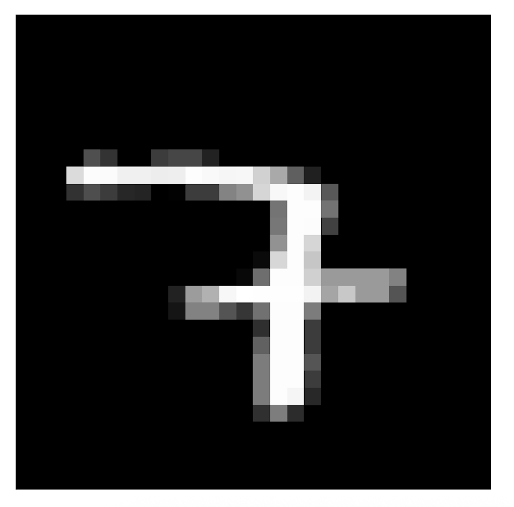
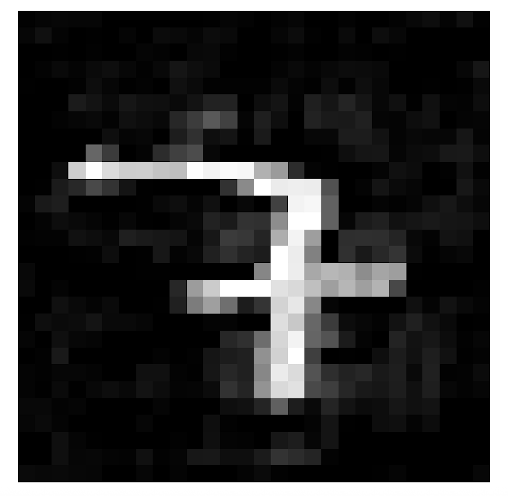
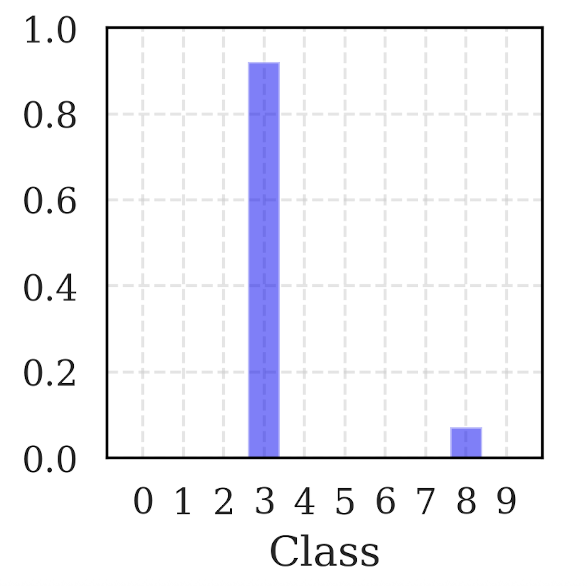
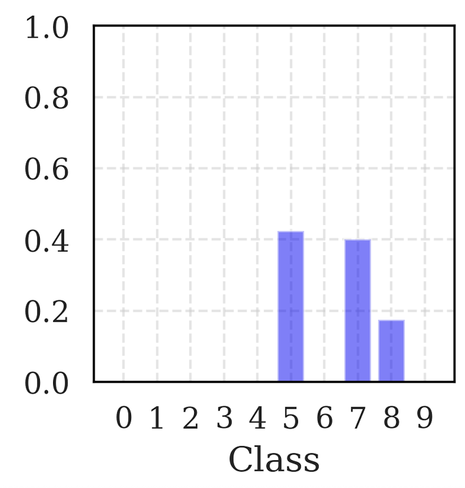

## Collaborating with Doctors

- A few years ago, I collaborated with (medical) doctors studying uterine fibroids (myomas).

  

---

## Comparing Medical Procedures

::: {.columns}

::: {.column width="50%"}
Doctors compared two minimally invasive treatments for myomas to determine which:

1. **Is more effective at reducing fibroid size**.
2. **Is less invasive for patients**, measured by shorter hospital stays, lower blood loss, etc.
:::

::: {.column width="50%"}
::: fragment
**Procedures Compared:**

- **Radiofrequency Ablation (RFA)**
- **Uterine Artery Embolization (UAE)**
:::
:::

:::

---

## Doctors' Initial Expectations

Doctors initially expected **RFA** to outperform the alternative treatment:

- More effective at reducing myoma size.
- Less invasive, resulting in shorter hospital stays and quicker recovery.

**Biased toward RFA!**

---

## Disappointing Results...

Statistical analysis revealed **no significant differences** between RFA and the alternative treatment regarding length of hospital stay.

**Data did not support the doctors' initial preference for RFA!**

---

## A "Statistical Adjustment" Suggestion

One doctor asked:

*"Can we perform a statistical adjustment to make RFA look better?"*

::: {.fragment}
And I replied

*"What do you mean by 'statistical adjustment'?"*
:::

::: {.fragment}
Doctor:

*"Look, if we remove this patient with an unusually large myoma from the RFA group, the results become significant!"*
:::

---

## Wait... Can We Do That?

- This is not how stats work!
- But this inspired a deeper question:

> How can one systematically select a minimal subset of data points to manipulate in order to alter a statistical/ML-based conclusion?

---

## Background

Adversarial Machine Learning (AML), studies 

- How **data manipulations** influence ML-based inferences, predictions, and decisions.

- How to design **robust ML methods** that are resistant to such manipulations.

We wil give an overview of AML attacks and defenses in the context of Bayesian Machine Learning.

---

## The Problem

- **Honest Bayesian** (Defender) observes training data
$$
\mathcal{D}_n = \{(X_i, y_i)\}_{i=1}^n.
$$

- Model: $y_i \mid X_i, \theta \sim p(\cdot \mid X_i, \theta)$ with prior $\theta \sim \pi(\theta)$.
- Goal: update beliefs about the unknown parameter $\theta \in \mathbb{R}^d$ based on observed data.

--- 

## The Bayesian Update

Posterior = prior x fit to the observed pairs:
$$
p(\theta \mid \mathcal{D}_n) \propto \underbrace{p(\theta)}_{\text{prior}} \times \underbrace{\prod_{i=1}^n p(y_i \mid X_i, \theta)}_{\text{likelihood of the observed pairs}}
$$

:::{.fragment}
- Score how well each $\theta$ explains all pairs $(X_i,y_i)$, reweight the prior, and then normalize.
:::

:::{.fragment}
- Typically approximated with MCMC or variational inference.
:::

---

## Posterior Predictive Distribution

- For a new covariate vector $x_{\text{new}}$, we average over all plausible parameter values.

$$
p(y_{\text{new}} \mid x_{\text{new}}, \mathcal{D}_n)
= \int p(y_{\text{new}} \mid x_{\text{new}}, \theta)\,p(\theta \mid \mathcal{D}_n)\,d\theta
$$

:::{.fragment}
- The predictive distribution not only gives a point prediction but also **quantifies uncertainty** about future outcomes.
:::

---

## UQ Example

  

---

## The Bayesian Approach to Decision-Making

- A decision means choosing an action $a \in \mathcal{A}$.

- A **utility** $u(a,s)$ tells us how desirable the consequence is if we take action $a$ and state $s$ happens.

- In our setting, $s$ could be an unknown parameter $\theta$ or a future outcome $Y_{\text{new}}$.

---

## The Bayesian Approach to Decision-Making

- We model our uncertainty about the state $s$ with a probability distribution $p(s \mid \mathcal{D}_n)$, which could be the posterior or the predictive distribution.

---

## The Bayesian Approach to Decision-Making

- In utility theory, a rational/coherent agent is one whose choices satisfy standard rationality axioms. A rational agent chooses the action that maximizes **expected utility**.

$$
a^* = \arg\max_{a \in \mathcal{A}} \int u(a,s) p(s | \mathcal{D}_n) ds
$$  

- In words: average the utility of each action over your posterior uncertainty, then pick the best one.

---

## Why This Matters

- In Bayesian ML, even small data manipulations can propagate through the pipeline and ultimately alter the decision induced by the model.

- An attack may target posterior **inference**, posterior **prediction**, or directly the final **decision rule**.

- In the rest of the talk, I focus on attacks on inference and prediction.

---

## Example: Mexico Microcredit Data

- Randomized controlled trial on microcredit (16,560 businesses) conducted in Mexico City (Angelucci et al., 2015).
- Treatment assignment: 
$$
x_i =
\begin{cases} 
1 & \text{microcredit} \\
0 & \text{control}
\end{cases}
$$

- Objective: Assess impact on business profit $y_i$.

---

## Example: Mexico Microcredit Data

**Model used**, parameters are $\theta = \lbrace \beta_0, \beta_1, \sigma \rbrace$: 
$$
p(y_i \mid X_i, \theta) = \mathcal{N}(\beta_0 + \beta_1 x_i, \sigma^2)
$$

**Priors**: $p(\theta) \beta_0,\,\beta_1,\, \log(\sigma) \sim t(3,\,0,\,1000)$

- Parameter $\beta_1$ represents the **Average Treatment Effect (ATE)**.

- It is the average change in profit caused by offering microcredit, so its sign and magnitude determine whether expanding the program looks beneficial or harmful.

---

## Example: Mexico Microcredit Data

- We observe data $\mathcal{D}_n = \{(X_i, y_i)\}_{i=1}^n$.

- $n = 16,560$

- We approximate posterior $p(\beta_0, \beta_1, \sigma | \mathcal{D}_n)$. 

---

## Posterior for the ATE

  

- Posterior mean of ATE ($\beta_1$): $-4.71$ (negative impact).
- Potential policy implication: **Do not expand microcredit.**

---

## From Posterior to Decision

- Consider two actions: $a \in \{\text{expand}, \text{do not expand}\}$.
- Suppose the policymaker utility is ($c$ is expansion cost).
$$
u(\text{expand}, \beta_1) = \beta_1 - c,
~~
u(\text{do not expand}, \beta_1) = 0
$$

---

## From Posterior to Decision

- Then expected utility for expanding is:
$$
\mathbb{E}[u(\text{expand}, \beta_1) \mid \mathcal{D}_n] = \mathbb{E}[\beta_1 \mid \mathcal{D}_n] - c = -4.71 - c,
$$

- For not expanding:
$$
\mathbb{E}[u(\text{do not expand}, \beta_1) \mid \mathcal{D}_n] = 0
$$

- Since $c > 0$, we have $-4.71 - c < 0$, so the Bayes action is: **do not expand microcredit**.

---

## Attacking Posterior Inferences

- **Attacker** manipulates data by deleting or replicating points.

- Represented by integer vector $w \in \mathbb{Z}_{\geq 0}^n$:
  - $w_i = 0$: remove data point $i$
  - $w_i > 1$: replicate data point $i$
  - $w_i = 1$: no change

---

## The Attacker

- Resulting posterior:
$$
\pi_w(\theta \mid \mathcal{D}_n) = \frac{1}{Z(w)} \left(\prod_{i=1}^n p(y_i \mid X_i, \theta)^{w_i}\right)\pi(\theta)
$$

- Goal: alter statistical conclusions by manipulating just a few data points.

---

## The Attack

Just removing a **strategically chosen** $0.12 \%$ $(B=20)$ of the  data points...

  
  
Tainted Posterior for ATE

---

## The Attack

- Now the optimal decision is to actually expand the microcredit program!!

---

## How do we find the points to manipulate?

 
 
**Goal:** Find **minimal** data manipulations $w \in \mathbb{Z}_{\geq 0}^n$ such that the resulting posterior $\pi_w(\theta \mid \mathcal{D}_n)$ is **as close as possible** to a target distribution $\pi_A(\theta)$.

---

## Formalizing the Adversary's Problem

Minimize forward KL divergence:
$$
\min_w \quad \text{KL}(\pi_A(\theta) \parallel \pi_w(\theta \mid \mathcal{D}_n))
$$

Subject to constraints:
$$
w \in \mathbb{Z}_{\geq 0}^n, \quad \|w - \mathbf{1}\|_1 \leq B, \quad \|w\|_\infty \leq L
$$

---

## But...

- Exact posterior often intractable (unknown normalization constant).
- There is no closed-form expression for the objective function.
- If curious see [here](https://openreview.net/forum?id=8rVkjNajF1).

---

## Attacks can also target predictions!

- Imagine a BNN trained on MNIST to classify digits.

- Data: $\mathcal{D}_n = \{(x_i, y_i)\}_{i=1}^n$, where $x_i$ is an image and $y_i \in \{0,\dots,9\}$ is its label.

- Representation (model and prior): put a prior on the network weights $W$, and let the network define $p(y \mid x, W)$.

---

## BNN for MNIST Classification

- Training: update this prior into a posterior
$$
p(W \mid \mathcal{D}_n) \propto p(W)\prod_{i=1}^n p(y_i \mid x_i, W),
$$
typically approximately with variational inference or stochastic-gradient MCMC.

---

## BNN for MNIST Classification

- Prediction: average the network outputs over posterior draws of the weights
$$
p(y_{\text{new}} \mid x_{\text{new}}, \mathcal{D}_n)= \\
\int p(y_{\text{new}} \mid x_{\text{new}}, W)\,p(W \mid \mathcal{D}_n)\,dW.
$$

- Infinite ensemble of networks, each weighted by how well it explains the training data.

---

## BNN for MNIST Classification

::: {.columns}

::: {.column width="42%"}

  

:::

::: {.column width="58%"}

  
  
Posterior predictive distribution

:::

:::

---

## Formalizing the Attack on BNN Predictions

- Start from a clean image $x$ and its BNN predictive distribution $p(y \mid x,\mathcal{D}_n)$.

- Unlike before, the attacker perturbs the test image itself, while leaving the training data untouched.

---

## Formalizing the Attack on BNN Predictions

- The attacker can only make a small change to the pixels:
$$
\mathcal{X}(x)=\{x' : \|x'-x\|\leq \epsilon\}.
$$

- Concrete example: the clean image is a 7, but the attacker wants the BNN to believe it is a 3. Make $p(Y=3 \mid x',\mathcal{D}_n)$ as large as possible.

---

## Formalizing the Attack on BNN Predictions

- The attacker looks for a perturbed image $x'$ that still looks similar to the original one, but maximizes the probability of class 3.

$$
x^*_{\text{adv}}
=
\arg\max_{x' \in \mathcal{X}(x)}
p(Y=3 \mid x',\mathcal{D}_n)
$$

- In words: among all small perturbations, find the one that makes the BNN say "3" as confidently as possible.

---

## Solving the Attack Problem

- Approximate the predictive probability with posterior samples $W^{(1)},\dots,W^{(M)}$:
$$
p(Y=3 \mid x',\mathcal{D}_n)
\approx
\frac{1}{M}\sum_{m=1}^M p(Y=3 \mid x', W^{(m)}).
$$

- We estimate $\nabla_{x'} p(Y=3 \mid x',\mathcal{D}_n)$ by backpropagating through the network.

- Then we update $x'$ with projected gradient ascent steps, projecting back onto $\mathcal{X}(x)$ after each step.

---

## Attack on BNN Predictions

::: {.columns}

::: {.column width="42%"}

  

:::

::: {.column width="58%"}

  
  
Posterior predictive distribution

:::

:::

---

## Attacks on uncertainty quantification

- The attacker can also target the BNN's uncertainty estimates.

- Make them **overconfident** in wrong predictions, or **underconfident** in correct ones.

---

## Attack on BNN Predictions

::: {.columns}

::: {.column width="42%"}

  

:::

::: {.column width="58%"}

  
  
Posterior predictive distribution

:::

:::

---

## What's going on?

- It seems that NNs (on clean data) learn **superficial patterns** that are not robust to small perturbations 

- i.e. they are not learning the true underlying concepts, but rather some shortcuts that work well on clean data but fail under adversarial conditions.

- This is **very serious** for safety-critical applications like autonomous driving, medical diagnosis, etc.

--- 

## Autonomous Driving Example

 
 

  
  
This stop sign is wrongly classified as speed limit by and ADS.

---

## Defending Against Attacks

- Suppose we knew exactly how a clean input $x$ is turned into an attacked input $x'$.
- Then two natural defenses are:
- **Purification**: try to invert the attack and recover the clean input.
- **Adversarial training**: train the network directly on attacked images.
- Both ideas depend on knowing, at least approximately, how the attacker behaves.

---

## But Usually We Do Not

- In practice, we do not know which attack will be used, how strong it will be, or how often it will appear.

- Bayesian view: model all the *known unknowns*.

- Not only model the data $y | x, \theta$, also model the attacker through a **probabilistic adversarial channel**
$$
p(x' \mid x,\theta),
$$
which represents a distribution over plausible perturbations.

---

## But Usually We Do Not

- Then purification and training can average over likely attacks, instead of assuming one fixed perturbation.

- Caveat, modelling humans, is hard (performative effects, infinite regressions, etc.)

- Game Theory, Adversarial Risk Analysis.

---

## Conclusions

- Small, plausible perturbations can change Bayesian posteriors, predictions, and therefore decisions.

- This is especially serious in safety-critical settings.

- So defenses should model the attacker probabilistically and train against a distribution of attacks.

- Arms race!

---

## Thank You!

Questions are welcome!

📧 **roi.naveiro@cunef.edu**  
🌐 [https://github.com/roinaveiro](https://github.com/roinaveiro)

 

  
  
Peña Ubiña (León)

