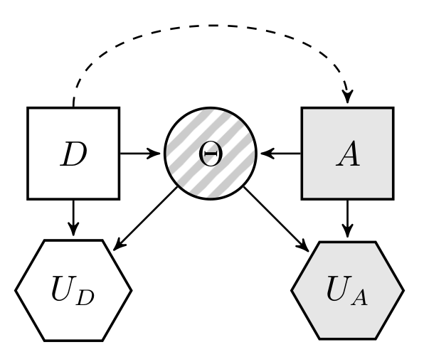
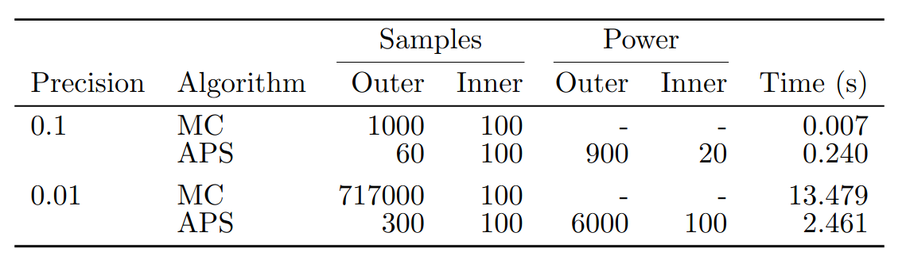
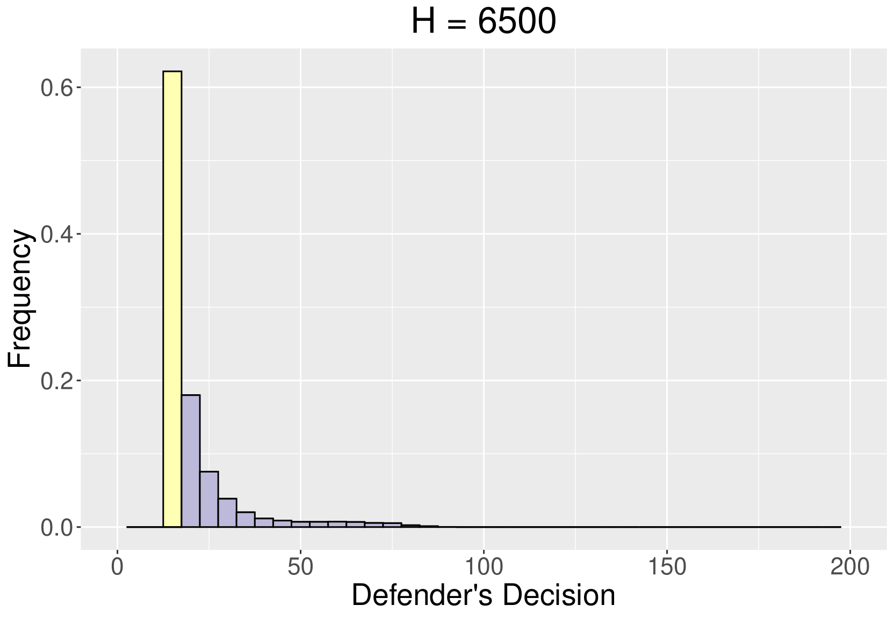
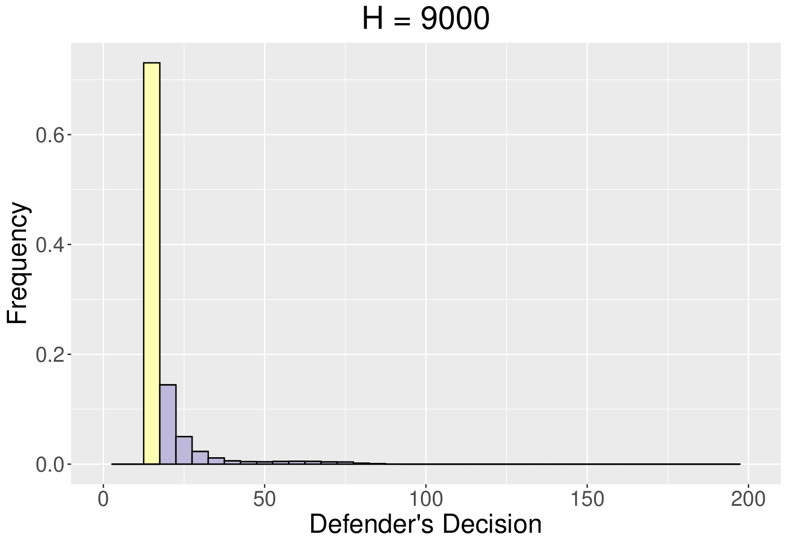

# Sequential Defense Attack Games

 

* Gaining Importance due to the raise of AML!

* Classical Decision Makers, Humans: **discrete** and **low dimensional** decision spaces. 

* New Decision Makers, Algorithms: **continuous** and **high dimensional** decision spaces.

---
# New Solution techniques 

* Forget about (general) analytic solutions!

* Must work with uncertain outcomes

* Must acknowledge uncertainty about adversary

* We propose a **Simulation-based** solution approach:

  * Solves general security games, with uncertain outcomes, complete and incomplete information
  
  * Explain it for Sequential Defend-Attack games under incomplete information
  

---
# Seq. Games with Uncertain Outcomes

---
# Game theoretic approach

* **Common Knowledge Assumtion**: the Defender knows the Attacker's probabilities and utilities.
* Compute expected utilities.

\begin{equation*}
\psi_A (a,d) = \int u_A (a, \theta )\, p_A(\theta \vert d,a)\, \mathop{}\! \mathrm{d} \theta \quad\text{and}\quad
\psi_D (d,a) = \int u_D (d, \theta )\, p_D(\theta \vert d,a) \mathop{}\! \mathrm{d} \theta.
\end{equation*}

--

* Attacker's best response to defense $d$
\begin{equation}
a^*(d) = \arg\max_{a \in \mathcal{A}}\, \psi_A(d,a)
\end{equation}

--

* Defender's optimal action

\begin{equation*}
d^*_\text{GT} = \arg\max_{d \in \mathcal{D}}\, \psi_D(d, a^*(d)).
\end{equation*}

* $\left[ d^*_\text{GT},\, a^*(d^*_\text{GT}) \right]$ is a **Nash equilibrium** and a **sub-game perfect equilibrium**.

---
# ARA approach

* Weaken Common Knowledge Assumption: the Defender **does not know** $(u_A, p_A)$.

* We need $p_D(a \vert d)$!

* Then, $d^*_{\text{ARA}} = \arg\max_{d \in \mathcal{D}} \psi_D(d)$, where

\begin{equation*}
\psi_D(d) = \int \psi_D(a,d)\, p_D(a \vert d) \mathop{}\! \mathrm{d}a = \int \left[ \int u_D (d, \theta)\, p_D(\theta \vert d,a) \mathop{}\! \mathrm{d} \theta \right]\, p_D(a \vert d) \mathop{}\! \mathrm{d} a ,
\end{equation*}

---
# ARA approach

* To elicitate $p_D(a \vert d)$, Defender analyses Attacker's problem.

* Model uncertainty about $(u_A, p_A)$ through distribution $F = (U_A, P_A)$.

* Induces distribution over attacker's expected utility $\Psi_A(a,d) = \int U_A(a,\theta) P_A(\theta \vert a,d)  \mathop{}\! \mathrm{d}  \theta$.

* And $A^*(d) = \arg\max_{x \in \mathcal{A}} \Psi_A(x,d)$
* Then,

\begin{equation}
    p_D(A \leq a \vert d) = \mathbb{P}_F \left[  A^*(d) \leq a \right],
\end{equation}

---
# ARA approach

* In practice, discretize decision set

* Draw $J$ samples $\left\{\left( P_A^i, U_A^i\right) \right\}_{i=1}^J$ from $F$ and 

\begin{equation}
   \hat{p}_D(a \vert d) \approx \frac{\# \{ a =  \arg\max_{x \in \mathcal{A}} \, \Psi_A^i(x,d) \}}{J},
\end{equation}

* ARA solution is a **Bayes-Nash Eq.** (in sequential games)

---
# MC solution method

* Requires generating $\vert \mathcal{D} \vert \times (\vert \mathcal{A} \vert \times Q \times J  + P)$ samples.

---
# APS - Idea 1

* Assume we can sample from $p_D(d | a)$

* Max expected utility 

$$d^*_{\text{ARA}} = \arg\max_{d} \int \int u_D(d, \theta) \cdot p_D(\theta | d, a) \cdot p_D(d | a) d \theta d a$$

* Define 

$$\pi_D(d, a, \theta) \propto u_D(d, \theta) \cdot p_D(\theta | d, a) \cdot p_D(d | a)$$
$~$

* Mode of marginal $\pi_D(d)$ is $d^*_{\text{ARA}}$ !

---
# APS - Idea 2

* Flat expected utilities, complicates mode identification

* Define 

$$\pi^H_D(d,\theta_1, \dots, \theta_H, a_1, \dots, a_H) \propto \prod_{i=1}^H u_D(d, \theta_i) \cdot p_D(\theta_i | d , a_i) \cdot p_D(a_i | d)$$

* Marginal more peaked around max!

$$\pi^H_D(d) \propto \left[ \int \int u_D(d, \theta) \cdot p_D(\theta | d, a) \cdot p_D(d | a) d \theta d a \right]^H$$

---
# APS - Implementation

* Sample from $\pi(d,\theta_1, \theta_2, \dots, \theta_H, a_1, \dots, a_H)$ using MCMC.

* Find mode of $d$ samples.

--

1. State of the Markov chain is $(d, \theta_1, \dots, \theta_H, a_1, \dots, a_H)$; 

2. $\tilde{d} \sim g(\cdot \vert d)$;

3. $\tilde{a}_i \sim p_D(a \vert \tilde{d})$ for $i = 1, \dots, H$;

3. $\tilde{\theta}_i \sim p_D(\theta \vert \tilde{d}, \tilde{a}_i)$ for $i = 1, \dots, H$;

4. Accept $\tilde{x}, \tilde{\theta}_1, \dots, \tilde{\theta}_H, \tilde{a}_1, \dots \tilde{a}_H$ with probability
$$
    \min \left \lbrace 1,  \frac{g(d \vert \tilde{d})}{g( \tilde{d} \vert d)} \cdot  \prod_{i=1}^H \frac{u_D(\tilde{d}, \tilde{\theta}_i)}{u_D(d, \theta_i )} \right \rbrace
$$
5. Repeat

--

* Embed this MCMC within an annealing schedule that increases H!

---
# APS for ARA - $p_D(a | d )$

* For given $d$, random augmented distribution $\Pi_A(a, \theta \vert d) \propto U_A(a, \theta ) P_A(\theta \vert d, a)$,

* Marginal $\Pi_A(a \vert d) = \int \Pi_A(a, \theta \vert d) d \theta$, proportional to $A$'s random expected utility $\Psi_A(d,a)$.

* Random optimal attack $A^*(d)$ coincides a.s. with mode of $\Pi_A(a \vert d)$.

* Then:

1. $u_A(a, \theta) \sim U_A(a, \theta)$ and $p_A(\theta \vert d, a) \sim P_A(\theta \vert d, a)$

2. Build $\pi_A(a, \theta \vert d) \propto u_A(a, \theta) p_A(\theta \vert d, a)$ which is a sample from $\Pi_A (a, \theta \vert d)$.

3. Find $\text{mode}[\pi_A(a \vert d)]$ which is a sample of $A^*(d)$, whose distribution is $\mathbb{P}_F \left[ A^* (d) \leq a  \right] =  p_D(a \leq d)$.

---
# APS vs MC

* MC requires $\vert \mathcal{D} \vert \times (\vert \mathcal{A} \vert \times Q \times J  + P)$ samples

* APS requires at most $N  \times (2M + 5) + 2M + 4$ samples

* Simple game with continuos decision sets

* Several in parallel

* Compute min number of samples s.t. 90% solutions coincide with truth (to required precision)

---
# Application

---
# Application

* Elicited probability $p(a \vert d)$ for some security controls.

---
# Application

* Histogram of samples of security controls.

---
# Application - Increasing H

---
# Application - Increasing H

---
# Application - Increasing H

---
# Application - Increasing H

---
# Application - Increasing H

---
# Application - Increasing H

---
# Application - Increasing H

---
# Application - Increasing H

---
# Application - Increasing H

---
# Application - Increasing H

---
# Application - Increasing H

---
# Application - Increasing H

---
# Application - Increasing H

---
# Application - Increasing H

---
# Application - Increasing H

---
# Application - Increasing H

---
# Application - Increasing H

---
# Application - Increasing H

---
# Application - Increasing H

---

# Conclusions 

* APS for games, both standard and ARA.

* APS better when cardinality of decision spaces is big (or spaces are continuous).

* Suggested **algorithmic approach**

  1. Use MC for broad exploration of decision space.
  2. Use APS within regions of interest to get refined solutions.
  

---

class: middle, center, inverse

# Thank you!!

**Website** roinaveiro.github.io/

**Email** roi.naveiro@icmat.es

**GitHub** github.com/roinaveiro

