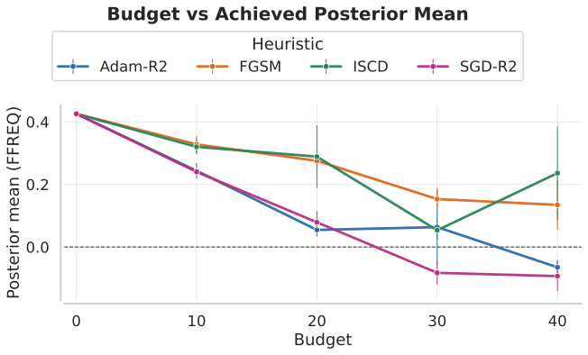

## Technical appendix {#appendix-start}

- Posterior sensitivity and attack optimization.
- Moment matching and decision targets.
- Exact defense models, practical approximations, and evaluation.

::: {.takeaway}
These are optional detours. [Return to the main talk](secure-ml.html#/conclusions-thanks).
:::

::: {.notes}
Use the menu to select a topic. This appendix is not included in the three-hour running order.
:::

## Why forward KL is convex in the weights {#poison-app-kl}

Let $\ell(\theta)$ contain the observation log likelihoods. Up to a constant in $w$:

$$
\begin{aligned}
F(w)&=\log Z(w)-w^\top\mathbb E_{\pi_A}[\ell(\theta)],\\
\nabla_w^2F(w)&=\operatorname{Cov}_{\pi_w}\!\left(\ell(\theta),\ell(\theta)\right)\succeq0.
\end{aligned}
$$

- The covariance matrix is positive semidefinite: the **continuous objective is convex**.
- This does not remove integer constraints, sampler error or rounding effects.

[Return to the attack algorithm](secure-ml.html#/poison-algorithm)

::: {.notes}
Optional, 2 minutes. Feasible integer weights satisfy w nonnegative, L1 distance from the all-ones vector at most B, and infinity norm at most L. Relaxation replaces integer by real weights. This log-normalizer derivation requires Z(w) finite on the region considered and differentiation under the integral justified, with the necessary log-likelihood moments. Positive semidefinite is not the same as positive definite; strict convexity is not guaranteed. The argument is for KL(target || weighted posterior). Do not transfer it to reverse KL or general MMD.

**Sources:** [Carreau, Naveiro & Caballero — AISTATS 2025](https://arxiv.org/abs/2503.04480)
:::

## Influence is a covariance {#poison-app-covariance}

For a posterior summary $h(\theta)$:

$$
\frac{\partial}{\partial w_i}\mathbb E_{\pi_w}[h(\theta)]
=\operatorname{Cov}_{\pi_w}\!\left(h(\theta),\ell_i(\theta)\right).
$$

- Increasing a row's weight raises the target expectation when its fit **covaries positively** with the target feature.
- The same identity applies to moments and decision utilities.
- It is a **local derivative**; large discrete changes require refitting.

[Return to moment matching](secure-ml.html#/poison-moment-matching)

::: {.notes}
Optional, 2 minutes. Differentiate the normalized weighted posterior: the score in weight i is ell_i minus its posterior mean. Multiply by h and integrate to obtain the covariance. The manuscript assumes finite second moments of h and the log-likelihood vector, plus regularity allowing differentiation under the integral. This is sufficient, not a blanket statement that every posterior moment exists. If h is an unbounded exponential utility feature, its integrability needs explicit checking. Posterior sampling approximates the covariance; finite chains can carry bias and autocorrelation.

**Sources:** [Posterior Attraction via Moment Matching — manuscript, gradient lemma](context/mmd/main.tex)
:::

## MMD defines what “close” means {#poison-app-mmd}

For independent draws within and across distributions:

$$
\mathrm{MMD}^2(P,Q;k)
=\mathbb E_{P,P}[k]-2\mathbb E_{P,Q}[k]+\mathbb E_{Q,Q}[k].
$$

- A **characteristic kernel** can distinguish full distributions.
- A feature kernel $k(\theta,\theta')=h(\theta)^\top h(\theta')$ compares only the selected feature expectations.
- Equal feature expectations can give zero discrepancy even when the posteriors differ.

[Return to moment matching](secure-ml.html#/poison-moment-matching)

::: {.notes}
Optional, 2 minutes. Explain that every expectation in the equation uses two independent draws, e.g. E_PP[k]=E[k(theta,theta')] for independent theta and theta' from P. Kernel embeddings require integrability, such as the manuscript's finite expected diagonal kernel condition. For finite feature maps the stated construction uses finite second moments. The objective is a squared feature-mean distance for a linear feature kernel. A characteristic kernel distinguishes distributions in its domain, but finite-budget optimization need not reach zero and does not guarantee the target is attainable. General MMD objectives in the observation weights need not be convex.

**Sources:** [Posterior Attraction via Moment Matching — manuscript, MMD formulation](context/mmd/main.tex)
:::

## From a moment target to a decision {#poison-app-decision}

Let $g_k(\theta)=u(a_k,\theta)-u(a_A,\theta)$ compare each alternative with the attacker's desired action.

$$
\left\|\mathbb E_{\pi_w}[g]+\gamma\mathbf1\right\|_2<\gamma
\quad\Longrightarrow\quad
\mathbb E_{\pi_w}[g_k]<0\ \text{for every }k.
$$

- With $\gamma>0$, this is a **sufficient condition** for the desired action to be uniquely optimal among finitely many actions.
- It concerns **exact expected utility gaps**. Monte Carlo estimates need uncertainty bounds before claiming a certificate.

[Return to the radon result](secure-ml.html#/poison-radon-result)

::: {.notes}
Optional, 2–3 minutes. Technical review of the current draft: the stated HalfNormal(1) prior on sigma_y does not give this utility-gap feature a finite second posterior moment. Holding the other parameters in a compact region, g(theta)^2 grows like exp(sigma_y^2), the prior contributes exp(-sigma_y^2/2), and the normal likelihood decays only as a power of sigma_y. Their product has a divergent tail integral. Thus the finite-second-moment assumptions used in the stated gradient and convergence results do not directly cover this radon feature. This observation alone does not invalidate the reported finite-sample mean estimates or prove the first moment infinite. Present the run as empirical, not theorem-certified; resolving the theory would require a separate argument or a revised model and rerun, neither done for this presentation.

Every coordinate of a vector is bounded in absolute value by its Euclidean norm; hence each expected gap lies strictly between -2 gamma and 0. This proves the displayed implication. The condition is sufficient but not necessary: all gaps may be negative even if the squared-distance target is poorly matched. In the displayed radon figure the estimated gap -11.4 favors no remediation despite missing the target -50. Exact expected utilities must exist; the gradient construction needs its stronger moment and regularity conditions. If a Monte Carlo confidence bound on the norm still lies below gamma, that can support an appropriately qualified probabilistic numerical statement, but the displayed exact identity alone does not supply such a bound. Draft source discrepancy: radon prose in context/mmd/main.tex gives rounded mean gaps 188 and -12, while context/mmd/figs/radon_lake_utility_gap_posterior.pdf labels 179.9 and -11.4. Its decomposition prose gives 2163-147-53=1963, while context/mmd/figs/radon_lake_cost_decomposition.pdf labels 2156-142-52=1962. The main deck now uses the original manuscript figures and their annotations, with expected costs 2179.9 and 1988.6 implied by the original gap plot. The optional decomposition asset is a plug-in diagnostic; it is no longer shown in the main deck. These draft discrepancies remain unresolved; no numeric certificate is asserted.

**Sources:** [Posterior Attraction via Moment Matching — manuscript, targeting decisions](context/mmd/main.tex)
:::

## One spatial run and repeated performance {#poison-app-spatial-budget}

::: {.columns}
::: {.column width="61%"}
{height=400px fig-alt="Spatial attack performance across deletion budgets and optimization methods"}
:::
::: {.column width="39%"}
- **Five runs per method**; error bars: **$\pm2$ standard errors**.
- Main example: selected **budget-20 Adam-R2 run**.
- Heuristics and rounding affect the returned attack.

::: {.small}
[Return to the spatial example](secure-ml.html#/poison-spatial-posteriors)
:::
:::
:::

::: {.notes}
Optional, 2 minutes. Distinguish the best feasible objective value—which cannot worsen as a nested budget increases—from the output of a finite heuristic, and distinguish discrepancy from a signed achieved mean which can overshoot zero. Do not describe the error bars as a 95% Bayesian credible interval or uncertainty over all possible attacks. They quantify variation in the reported small set of runs. Adam-R2 and SGD-R2 denote relaxation followed by rounding; FGSM uses a one-step gradient-based heuristic and ISCD iterates greedy coordinate changes. Detailed optimizer settings are in the manuscript.

**Sources:** [Posterior Attraction via Moment Matching — manuscript, spatial experiments](context/mmd/main.tex)
:::

## Predictive entropy has two components {#appendix-entropy}

$$
H(Y\mid x,D)=
\underbrace{\mathbb E_{\theta\mid D}H(Y\mid x,\theta)}_{\text{average within-model uncertainty}}
+\underbrace{I(Y;\theta\mid x,D)}_{\text{disagreement across models}}.
$$

- The second term measures dependence between predictions and parameters.
- Both depend on the model and posterior approximation.
- Neither term is a calibration test or a guaranteed attack detector.

::: {.notes}
**Optional: 3 minutes.** This is the entropy chain-rule identity for the joint predictive distribution of Y and theta conditional on x,D. Derive it by writing mutual information as predictive entropy minus expected conditional entropy. The usual epistemic/aleatoric interpretation is useful within the assumed model; do not present it as an observable, unique decomposition of all real-world ignorance. Parameter uncertainty does not itself represent model misspecification or uncertainty about an omitted adversarial channel. In finite-class classification the entropies are discrete; use one logarithm base consistently. All attacks in the main narrative concern predictive quantities, while the precise objective determines which aspect they alter.
:::

## The reactive update really is joint {#appendix-reactive}

$$
p(x,\theta,\phi\mid x',D)
\propto
p(x'\mid x,\theta)\,p(x\mid\phi)\,p(\theta,\phi\mid D).
$$

- $\phi$ parameterizes the distribution of clean inputs.
- The received input updates plausible originals **and** global parameters.
- The offline approximation suppresses the second update.

::: {.notes}
**Optional: 3 minutes.** Integrate p(y | x,theta) against this joint posterior. The posterior over theta,phi after observing x prime is proportional to m(theta,phi;x prime)p(theta,phi | D), where m is the channel likelihood integrated against p(x | phi). In the empirical online implementation, sample theta_s from the clean posterior and use clean training inputs x_i; normalize the products p(x prime | x_i,theta_s) globally across both s and i. In the offline implementation, normalize separately over i for each s, then average parameter draws equally. These operations generally differ. Require positive finite normalizers. Replacing p(x | phi) by the empirical input distribution is a computational approximation, particularly restrictive in high dimensions. The main slide has marginalized phi into p(x,theta | x prime,D).

**Sources:** [Defense manuscript, reactive predictive distribution](context/adv_bayes_tmlr/main.tex). Work in progress.
:::

## Two objectives that should not be confused {#appendix-generalized}

**Generative channel likelihood**

$$
\log \mathbb E_{x'\mid x,\theta}p(y\mid x',\theta).
$$

**Practical surrogate contribution**

$$
\mathbb E_{x'\mid x,y,\theta}\log p(y\mid x',\theta).
$$

The experiments use channel-averaged losses and a **generalized Bayesian** posterior.

::: {.notes}
**Optional: 4 minutes.** Two distinct issues are displayed together and must be explained separately. First, even for a label-independent channel, moving the log inside the expectation produces a Jensen lower bound and changes the unconstrained variational target to a Gibbs posterior with channel-averaged log loss. Second, when the channel depends on y, the training graphical model with x prime generating y would form a directed cycle if y also generated x prime. The integrated expression is not generally a normalized conditional label likelihood. A coherent generalized Bayesian update is still available: p_eta(theta | D) proportional to p(theta)exp[-eta sum_i E_channel{-log p(y_i | x_i prime,theta)}]. The label-conditioned term on this slide therefore also changes the distribution under the expectation; Jensen compares the two expressions directly only when the SAME label-independent channel is used. In the manuscript eta is one for the experimental variational objective. The practical optimizer uses a factorized Gaussian family, giving another approximation. Do not label all experimental fits exact ordinary Bayesian inference under the generative diagram.

**Sources:** [Defense manuscript, SELBO and label-conditioned channels](context/adv_bayes_tmlr/main.tex). Work in progress.
:::

## What was the evaluation attacker allowed to do? {#appendix-evaluation}

| Component | Manuscript evaluation |
|---|---|
| Access | White-box, each defense's own predictive distribution |
| Constraint | $L_2$ perturbation budget $\epsilon$ |
| PGD | 50 likelihood-objective steps |
| PGD+ | 25 likelihood steps + 25 entropy steps |
| Selective prediction | Increase digit entropy; decrease FashionMNIST entropy |

::: {.notes}
**Optional: 3 minutes.** Distinguish attack knowledge, feasible manipulations, objective, and optimizer effort. Attacks are constructed independently for each defense and differentiate through posterior averaging. Training channels include one-step attacks and learned generators, so some evaluation methods are not the specific channel instantiations used in training. This gives evidence of transfer across these settings, not all possible unseen threats. The AT baseline's one-step training is a bounded comparison; an additional multi-step-trained AT model appears in the appendix. A broader security evaluation could examine restart sensitivity, other norms and semantic constraints, distribution shift, approximation sensitivity, query constraints, and computation-aware adaptive attacks. These are follow-up checks rather than results produced for this presentation.

**Sources:** [Defense manuscript, experimental setup](context/adv_bayes_tmlr/main.tex). Work in progress.
:::

## Where is the computational cost paid? {#appendix-defense-costs}

| MNIST, reported configuration | Standard | Defended |
|---|---:|---:|
| Training, ms per batch iteration | 2.48 | 4.69 (MIX) |
| Prediction, ms per input | 1.60 | 2470 (onPure) |

- onPure: $S=5$ parameter draws, $N=100$ stored input samples.
- Low-dimensional regression: roughly fivefold reactive overhead.
- These are implementation measurements, not computational lower bounds.

::: {.notes}
**Optional: 2 minutes.** Training and inference rows refer to different defended configurations: MIX proactive training and onPure reactive inference. They are not the training and inference costs of one composite method. Ordinary proactive deployment uses posterior averaging like the standard inference column, with a no-test-update approximation. The reactive method also requires storage of clean inputs or an adequate approximation to their distribution. The manuscript notes that standard and robust training pipelines were not equally optimized, so fine comparisons on regression tasks should not be read as universal efficiency claims. The workflow must value delay and review alongside predictive performance; this is another reason to evaluate defense choice through decisions.

**Sources:** [Defense manuscript, computational times](context/adv_bayes_tmlr/main.tex). Work in progress.
:::
